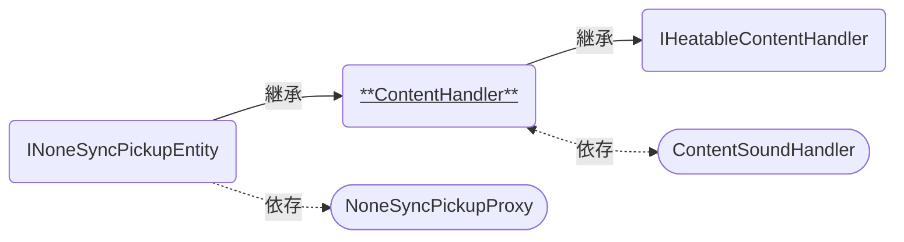

# ContentHandler

コーヒー豆をはじめとした中身の保持・受け渡しを行う「容器」の機能を持つコンポーネントです。  
複数のContentHandler同士で連携して使います。

### 関連コンポーネント

- [INoneSyncPickupEntity]
  - [NoneSyncPickupProxy]
- [IHeatableContentHandler]
- [ContentSoundHandler]

---

## 機能について

- 本コンポーネントと同時に以下のコンポーネントが必要です。
  - Collider系コンポーネント
  - RigidBody (`Use Gravity`オフ、`Is Kinematic`オン)
- [NoneSyncPickupProxy]を介してUseされると、中身をパーティクルとして出すことができます。
  - 再度UseすることでパーティクルのON/OFFを切り替えます。
  - 中身が入っていない場合、パーティクルは出せません。
- ほかのContentHandlerにパーティクルを当てることで、保持している中身を渡すことができます。
- ほかのContentHandlerからパーティクルを当てられると、その中身を受け取ります。
  - 受け取れる中身の種類や挙動は、後述の設定によって決まります。
  - 中身を受け取るときに、その種類に応じた効果音が[ContentSoundHandler]によって再生されます。

## 設定項目

| Components | 説明 |
| ---- | ---- |
| Animator | 状態に応じた見た目の制御を行うためのアニメーターを設定します。 |
| Particle | 内容物の受け渡し判定に使うためのパーティクルシステムを設定します。 |
| Sound Handler | 中身に応じた効果音を再生するためのUdonコンポーネントを設定します。 詳細は[ContentSoundHandler]をご覧ください。 |

| Settings | 説明 |
| ---- | ---- |
| Def Content | 最初に入っている中身の種類を設定します。 |
| Def Volume | 最初に入っている中身の量を設定します。値の範囲はbyte型 (0~255の整数) です。 |
| Max Volume | 中身の最大容量を設定します。値の範囲はbyte型 (0~255の整数) です。 |
| Feed Volume | 他の容器へ中身を渡すとき、一度に渡す量を設定します。値の範囲はbyte型 (0~255の整数) です。 |
| Allow Content | 他の容器から中身を渡されるとき、受け入れる中身の種類を設定します。 |

<table>
    <thead>
        <tr>
            <th colspan="2">Options</th>
            <th>説明</th>
        </tr>
    </thead>
    <tbody>
        <tr>
            <td colspan="2">Is Infinity</td>
            <td>他の容器へ中身を渡すときに、自身の中身を減らさず無限に供給できるようにします。</td>
        </tr>
        <tr>
            <td colspan="2">Is Stop When Feed</td>
            <td>他の容器へ中身を渡したときに、パーティクルを止めるようにします。</td>
        </tr>
        <tr>
            <td colspan="2">Accept Mode</td>
            <td>他の容器から中身を渡されるときの、中身の受け入れ方法を設定します。</td>
        </tr>
        <tr>
            <td></td>
            <td>YES</td>
            <td>中身を受け取ります。保持している中身と異なる場合は受け取りません。</td>
        </tr>
        <tr>
            <td></td>
            <td>NO</td>
            <td>中身を受け取りません。</td>
        </tr>
        <tr>
            <td></td>
            <td>OVERRIDE</td>
            <td>中身を受け取ります。保持している中身と異なる場合は上書きします。</td>
        </tr>
        <tr>
            <td></td>
            <td>ERASE</td>
            <td>中身を受け取りますが、保持せずに消去します。</td>
        </tr>
        <tr>
            <td colspan="2">Coll Interval</td>
            <td>他の容器から中身を渡されるときの、判定のインターバル時間 (単位:秒) を設定します。</td>
        </tr>
    </tbody>
</table>

## 仕様詳細

- 内容物の受け渡しは`OnParticleCollision`イベントによって発生します。
- `Def Content`と`Def Volume`については、ワールドへ最初に入った人物 (Join時にオブジェクトのOwner権限を握っている人物) のみが設定を反映します。
  - Late-Joiner視点では、各オブジェクトのOwnerが把握している状態が同期されます。
- 空き容量よりも相手の`Feed Volume`が大きい場合、溢れた分の中身は消滅します。
  - `Accept Mode`が`ERASE`の場合は、空き容量に関わらず中身を消去できます。
- `Accept Mode`に設定された受け入れ方法に関わらず、`Allow Content`に設定されていない中身は受け入れません。
  - 例えば`Allow Content`が`RAW_BEANS`,`ROASTED_BEANS`に、`Accept Mode`が`ERASE`にそれぞれ設定されている場合は、「`RAW_BEANS`と`ROASTED_BEANS`だけを消し去る容器」として機能します。

[INoneSyncPickupEntity]: /docs/udon/INoneSyncPickupEntity
[IHeatableContentHandler]: /docs/udon/IHeatableContentHandler
[NoneSyncPickupProxy]: /docs/udon/NoneSyncPickupProxy
[ContentSoundHandler]: /docs/udon/ContentSoundHandler

