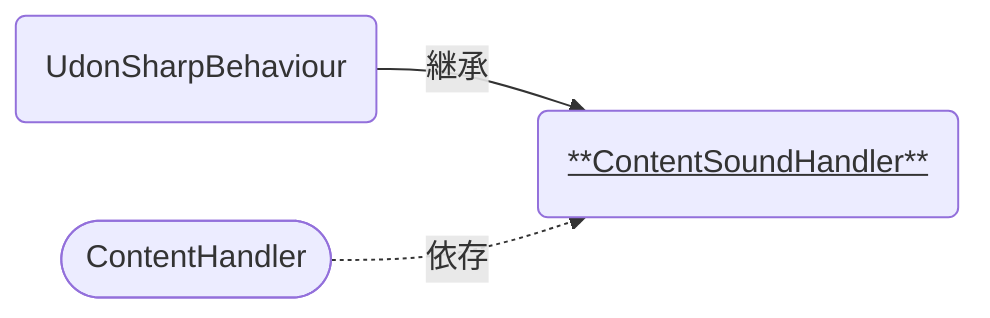

# ContentSoundHandler

中身の種類に対応した音源の再生を行うコンポーネントです。  
[ContentHandler]に紐づけて使います。

### 関連コンポーネント

- [ContentHandler]

---

## 機能について

- 本コンポーネントと同時に以下のコンポーネントが必要です。
  - AudioSource
    - VRCSpatialAudioSource (任意)
- [ContentHandler]が中身を受け入れたときにイベントが呼び出され、その中身の種類に応じた効果音を再生します。

## 設定項目

| Components | 説明 |
| ---- | ---- |
| Audio | 音源の再生に使うためのAudioSourceを設定します。[^1] |

| Sound | 説明 |
| ---- | ---- |
| Raw Beans | 生の豆が入れられた際の効果音(AudioClip)を設定します。 |
| Roasted Beans | 焙煎豆が入れられた際の効果音(AudioClip)を設定します。 |
| Coffee Powder | コーヒー粉が入れられた際の効果音(AudioClip)を設定します。 |
| Coffee Liquid | 液体コーヒーが入れられた際の効果音(AudioClip)を設定します。 |
| Water | 水が入れられた際の効果音(AudioClip)を設定します。 |

| Options | 説明 |
| ---- | ---- |
| Volume | 効果音を再生するときの音量を設定します。[^2] 値の範囲はfloat値で0.0~1.0です。 |

## 仕様詳細

- 音源の再生は`AudioSource::PlayOneShot(...)`で行われます。
  - 音源が重複して再生される仕様のため、設定する音源には尺の短いものを推奨します。
- 現実に起こる現象としては、お湯と水では容器へ注いだ際の音が異なりますが、現時点ではお湯のみを想定して`WATER`に一本化しています。

---

### 注釈

[^1]: AudioSourceは別オブジェクトに付与されていても構いません。
[^2]: AudioSourceと同時に付与する、VRCSpacialAudioSourceのGain値も音量に影響します。音量を変更する際は両方のパラメータを適切に設定し、実際にVRChat上で試聴のうえご利用ください。

[ContentHandler]: {{site.baseurl}}/docs/udon/ContentHandler

