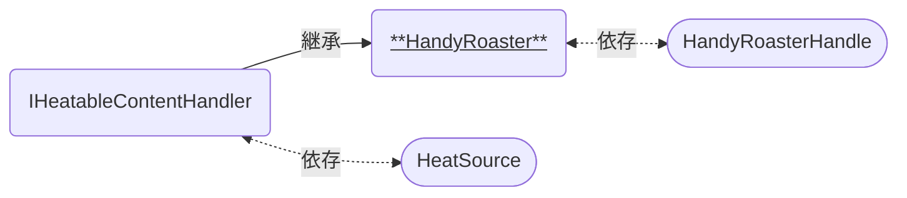

# HandyRoaster

手動焙煎機のメイン機能を持つコンポーネントです。  
[HandyRoasterHandle]および[HeatSource]と連携して使います。

### 関連コンポーネント

- [IHeatableContentHandler]
  - [ContentHandler]
- [HeatSource]
- [HandyRoasterHandle]

---

## 機能について

継承元スクリプトの機能を引き継いでいるため、関係する機能をあわせて記載しています。

### [ContentHandler]共通

- 本コンポーネントと同時に以下のコンポーネントが必要です。
  - Collider系コンポーネント
  - RigidBody (`Use Gravity`オフ、`Is Kinematic`オン)
- [NoneSyncPickupProxy]を介してUseされると、中身をパーティクルとして出すことができます。
  - 再度UseすることでパーティクルのON/OFFを切り替えます。
  - 中身が入っていない場合、パーティクルは出せません。
- ほかのContentHandlerにパーティクルを当てることで、保持している中身を渡すことができます。
- ほかのContentHandlerからパーティクルを当てられると、その中身を受け取ります。
  - 受け取れる中身の種類や挙動は、後述の設定によって決まります。
  - 中身を受け取るときに、その種類に応じた効果音が[ContentSoundHandler]によって再生されます。

### [IHeatableContentHandler]共通

- 点火している[HeatSource]のCollider判定へ入ると、加熱されていることを知らせるイベントを受け取ります。
  - 判定に入ってから点火する場合・点火してから判定に入る場合のいずれでも反応します。

### 本コンポーネント特有

- 中身が生の豆である場合、かつ加熱されている間は焙煎が行えます。
  - 焙煎できる状態になると、効果音と演出パーティクルが動作します。
- 本コンポーネントに紐づいた[HandyRoasterHandle]をピックアップすると豆の焙煎が進みます。
  - 焙煎が進むのはハンドルがピックアップされている間のみです。
  - 途中でハンドルを手放すと、焙煎の進行度も途中で止まります。
- 後述の設定によって決められた時間が経過すると焙煎が完了し、中身が生の豆から焙煎豆へ変化します。
  - 中身の量は、焙煎の前後でそのまま引き継がれます。

## 設定項目

共通の設定については[ContentHandler]の説明も合わせてご参照ください。

| Components | 説明 |
| ---- | ---- |
| nyoe | にょえ |
| nyoe | にょえ |
| nyoe | にょえ |

| Settings | 説明 |
| ---- | ---- |
| nyoe | にょえ |

## 仕様詳細

- にょえ

[IHeatableContentHandler]: /docs/udon/IHeatableContentHandler
[ContentHandler]: /docs/udon/ConentHandler
[NoneSyncPickupProxy]: /docs/udon/NoneSyncPickupProxy
[ContentSoundHandler]: /docs/udon/ContentSoundHandler
[HeatSource]: /docs/udon/HeatSource
[HandyRoasterHandle]: /docs/udon/HandyRoasterHandle

