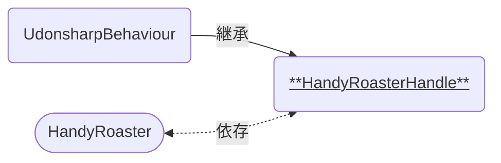

# HandyRoasterHandle

手動焙煎機の回転ハンドル部分に関わる機能を持つコンポーネントです。  
[HandyRoaster]に紐づけて使います。

### 関連コンポーネント

- [HandyRoaster]

---

## 機能について

- 本コンポーネントと同時に以下のコンポーネントが必要です。
  - VRCPickup
    - RigidBody
  - VRCObjectSync
- ピックアップされると、紐づいている[HandyRoaster]へハンドルが掴まれていることを知らせます。
- ハンドルを手放すと、後述の設定によって決められたGameObjectの位置へテレポートされます。
  - ハンドルのピックアップ判定をもとの位置に戻すための機能です。
- 紐づいている[HandyRoaster]が中身を保持している場合、本コンポーネントの移動速度に応じて効果音を再生します。
  - 焙煎に伴って豆が転がる音を再現するための機能です。
  - 音を鳴らすのは生の豆または焙煎豆が入っている場合のみです。それ以外の場合は音を再生しません。

## 設定項目

| Components | 説明 |
| ---- | ---- |
| nyoe | にょえ |
| nyoe | にょえ |
| nyoe | にょえ |

| Settings | 説明 |
| ---- | ---- |
| nyoe | にょえ |

## 仕様詳細

- にょえ

[HandyRoaster]: /docs/udon/HandyRoaster
