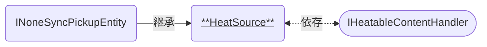

# HeatSource

コーヒーの焙煎工程で使う「熱源」の機能を持つコンポーネントです。   
[IHeatableContentHandler]と連携して使います。

### 関連コンポーネント

- [INoneSyncPickupEntity]
- [IHeatableContentHandler]

---

## 機能について

- 本コンポーネントと同時に以下のコンポーネントが必要です。
  - Collider系コンポーネント(`Is Trigger`オン)
- [NoneSyncPickupProxy]を介してUseされると、点火状態へ切り替えます。
  - 再度Useすることで点火/消火の状態を切り替えます。
- 点火している場合、Colliderの判定へ入ってきた[IHeatableContentHandler]派生クラスへ加熱していることを知らせます。
  - 判定に入ってから点火する場合・点火してから判定に入る場合のいずれでも反応します。

## 設定項目

| Components | 説明 |
| ---- | ---- |
| `Animator` | 点火/消火の状態に応じた見た目の制御を行うためのアニメーターを設定します。 |

| Settings | 説明 |
| ---- | ---- |
| `Handlers` | 最初から判定に入っている[IHeatableContentHandler]を設定します。[^1] |

## 仕様詳細

- 加熱の判定に入っているかどうかの判断は`OnTriggerEnter/Exit`イベントによって行われます。
- 複数のオブジェクトを同時に加熱することも可能ですが、内部実装の都合からパフォーマンスに悪影響を及ぼすおそれがあります。過剰に多数のオブジェクトを同時に加熱することはお控えください。

---

[^1]: Unityの仕様によりインスタンス起動時には`OnTriggerEnter`が反応せず、最初から判定に入っているものが加熱対象とならないのを回避するためのものです。 意図しない挙動が発生しうるため、最初から[IHeatableContentHandler]が判定に入っていない場合には設定しないことを推奨します。

[INoneSyncPickupEntity]: /docs/udon/INoneSyncPickupEntity
[NoneSyncPickupProxy]: /docs/udon/NoneSyncPickupProxy
[IHeatableContentHandler]: /docs/udon/IHeatableContentHandler

