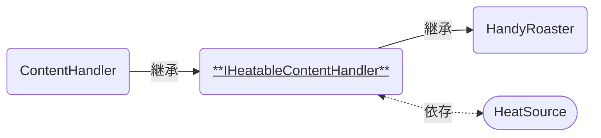

# IHeatableContentHandler

コーヒーの調理工程で、容器が「加熱される」機能を実装する抽象クラスです。  
[HeatSource]と連携して使います。

### 関連コンポーネント

- [ContentHandler]
- [HandyRoaster]
- [HeatSource]

---

## 概要

コーヒーの調理工程で、例えば豆の焙煎やサイフォンの加熱などを行う際に、その火元を共通で使えるようにするための抽象クラスです。  
この抽象クラスでは「加熱されている」という情報の同期のみを実装しており、具体的な処理についてはこれを継承した派生クラスで実装します。

## 機能について

- 本スクリプトは抽象クラスのため、コンポーネントとしてGameObjectへ付与することはできません。
- 点火している[HeatSource]のCollider判定へ入ると、加熱されていることを知らせるイベントを受け取ります。
  - 判定に入ってから点火する場合・点火してから判定に入る場合のいずれでも反応します。

## 設定項目

本スクリプト特有の設定項目はありません。  
親クラス[ContentHandler]の説明をご参照ください。

[ContentHandler]: {{site.baseurl}}/docs/udon/ContentHandler
[HandyRoaster]: {{site.baseurl}}/docs/udon/HandyRoaster
[HeatSource]: {{site.baseurl}}/docs/udon/HeatSource

