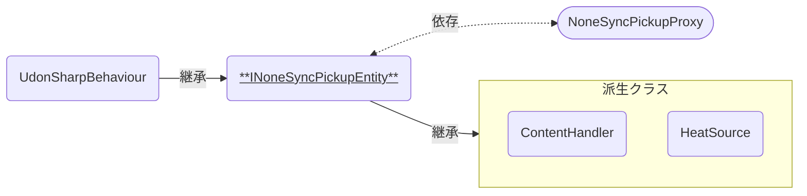

# INoneSyncPickupEntity

Pickupオブジェクトにおいて、「VRCObjectSyncによる位置の同期」と「UdonSynced変数のManual同期」とを両立するための抽象クラスです。  
[NoneSyncPickupProxy]に紐づけて使います。

### 関連コンポーネント

- [NoneSyncPickupProxy]
- [ContentHandler]
- [HeatSource]

---

## 概要

VRCObjectSyncは、UdonBehaviourの同期モードでContinuousに相当する機能を持ちます。  
そのため、Manual同期したいUdonBehaviourとVRCObjectSyncを同じオブジェクトへ付与すると変数の同期に不都合が生じる場合があり、推奨されません。

本アセットではこれを解決するため、「Pickupイベントの呼び出し」と「変数の同期を含むメイン機能」とを別スクリプトに分割することで機能の両立を図っています。  
INoneSyncPickupEntityはメイン機能を実装するための抽象クラスです。

## 機能について

- 本スクリプトは抽象クラスのため、コンポーネントとしてGameObjectへ付与することはできません。
- [NoneSyncPickupProxy]との紐づけには、これを継承した派生コンポーネントを組み合わせてご利用ください。

[NoneSyncPickupProxy]: /docs/udon/NoneSyncPickupProxy
[ContentHandler]: /docs/udon/ContentHandler
[HeatSource]: /docs/udon/HeatSource
