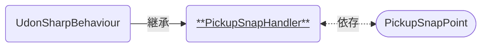

# PickupSnapHandler

Pickupオブジェクトを手放したとき、その置かれた位置を補正するためのコンポーネントです。  
[PickupSnapPoint]と組み合わせて使われます。

### 関連コンポーネント

- [PickupSnapPoint]

---

## 機能について

- 本コンポーネントと同時に、以下のコンポーネントが必要です。
  - Collider系コンポーネント
  - VRCPickup
    - RigidBody
  - VRCObjectSync (任意)
- [PickupSnapPoint]の判定に入っているときに手放されると、後述の設定に応じてPickupオブジェクトをテレポートさせます。
  - Pickupオブジェクトの位置を自動で合わせるための機能です。

## 設定項目

| Settings | 説明 |
| ---- | ---- |
| Snap ID | スナップ対象となるIDを設定します。 一致するIDを持った[PickupSnapPoint]にのみスナップします。[^1] |
| Point | インスタンス起動時からスナップ対象となる[PickupSnapPoint]を設定します。[^2] |

## 仕様詳細

---

[^1]: ただし`SnapID`が設定されていない[PickupSnapPoint]には、本コンポーネントの`SnapID`にかかわらずスナップします。
[^2]: Unityの仕様によりインスタンス起動時には`OnTriggerEnter`が反応せず、最初から判定に入っているものがスナップ対象とならないのを回避するためのものです。 最初から[PickupSnapPoint]の判定に入っていない場合には設定しないことを推奨します。

[PickupSnapPoint]: /docs/udon/PickupSnapPoint/

