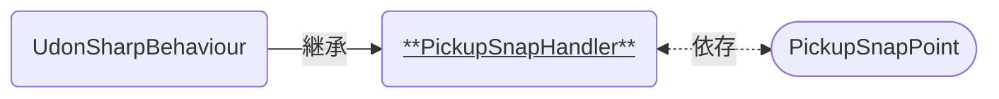

# PickupSnapHandler

Pickupオブジェクトを手放したとき、その置かれた位置を補正 (スナップ) するためのコンポーネントです。  
[PickupSnapPoint]と連携して使います。

### 関連コンポーネント

- [PickupSnapPoint]

---

## 機能について

- 本コンポーネントと同時に、以下のコンポーネントが必要です。
  - Collider系コンポーネント
  - VRCPickup
    - RigidBody
  - VRCObjectSync (任意)
- [PickupSnapPoint]のCollider判定に入っているときに手放されると、後述の設定に応じて位置をスナップします。

## 設定項目

| Settings | 説明 |
| ---- | ---- |
| Snap ID | スナップ対象となるIDを設定します。 一致するIDを持った[PickupSnapPoint]にのみスナップします。[^1] |
| Point | 最初から判定に入っている[PickupSnapPoint]を設定します。[^2] |

## 仕様詳細

- オブジェクトのスナップは`VRCPickup::Teleport(...)`によって行われます。
  - テレポート先は、[PickupSnapPoint]が付与されたGameObjectと同じ位置・角度です。

---

[^1]: ただし`SnapID`が設定されていない[PickupSnapPoint]には、本コンポーネントの`SnapID`に関わらずスナップします。
[^2]: Unityの仕様により、最初から判定に入っているオブジェクトがスナップ対象とならない現象を回避するための設定です。最初から[PickupSnapPoint]の判定に入っていない場合は、意図しない挙動を防止するためオブジェクトを設定せずにご利用ください。

[PickupSnapPoint]: /docs/udon/PickupSnapPoint/

