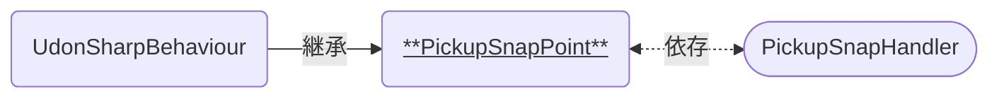

# PickupSnapPoint

Pickupオブジェクトを手放したとき、その置かれた位置を補正 (スナップ) するためのコンポーネントです。  
[PickupSnapHandler]と連携して使います。

### 関連コンポーネント

- [PickupSnapHandler]

---

## 機能について

- 本コンポーネントと同時に以下のコンポーネントが必要です。
  - Collider系コンポーネント(`Is Trigger`オン)
- [PickupSnapHandler]がCollider判定に入ると、後述の設定に応じてスナップ先を知らせます。
  - オブジェクトがCollider判定を抜けると、スナップ先から外れます。

## 設定項目

| Settings | 説明 |
| ---- | ---- |
| Snap ID | スナップ対象となるIDを設定します。 一致するIDを持った[PickupSnapHandler]のみがスナップできます。[^1] |

## 仕様詳細

- [PickupSnapHandler]によるスナップは、本コンポーネントが付与されているGameObjectと同じ位置・角度へテレポートする形で行われます。本コンポーネントの設置場所にはご注意ください。
- テレポート先の通知は`OnTriggerEnter/Exit`イベントによって行われます。

---

[^1]: ただし`SnapID`が設定されていない場合は、その設定に関わらず全ての[PickupSnapHandler]がスナップできます。

[PickupSnapHandler]: /docs/udon/PickupSnapHandler/

